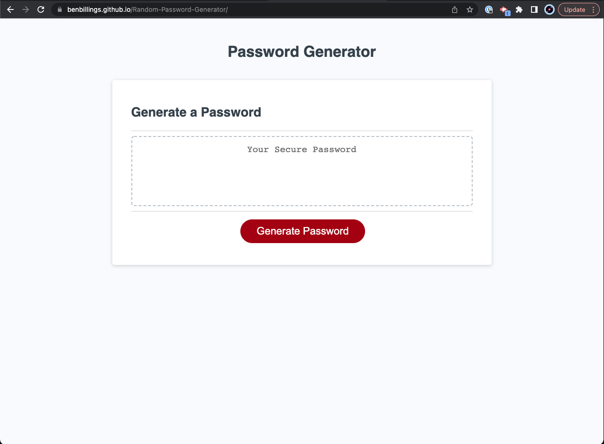

# Random-Password-Generator

## Deployed Application
https://benbillings.github.io/Random-Password-Generator/

## Purpose

The purpose of this project was to create a random password generator that gives the user options about the length of the password as well as the character types used in it. 
When a number not within the range is entered for the length of the password, the user is given an error message and is told to start over. Also, if no character types are 
selected the result is a message reminding the user to select at least one. 

## Technologies Used

- Javascript
- Html
- CSS

## Improvments to be made

- When the correct number of characters is entered, yet no character types are selected, both error messages are shown to the user
- The error message for character types is shown when an incorrect number of characters is entered by user

